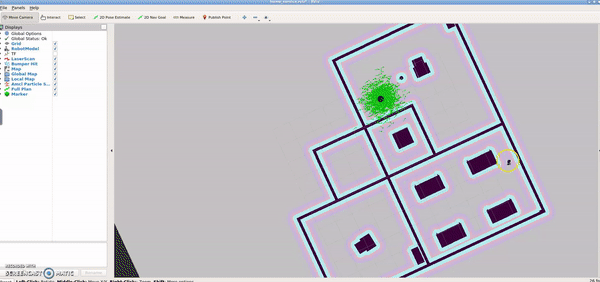

# Home-Service-Robot
In this project an [amcl](http://wiki.ros.org/amcl) package is used to loclize a robot in agiven map, then [move_base](http://wiki.ros.org/move_base) package is used so plan path between pick-up point and drop off point of an virtual object.

  <tr>
    <th>

           </a>
            home_service
        

    </th>

## Project tree:

# Home Service Project

* [add_markers/](.\src\add_markers)
  * [launch/](.\src\add_markers\launch)
    * [home_service_rviz_config.launch](.\src\add_markers\launch\home_service_rviz_config.launch)
  * [src/](.\src\add_markers\src)
    * [add_markers.cpp](.\src\add_markers\src\add_markers.cpp)
    * [add_markers_test.cpp](.\src\add_markers\src\add_markers_test.cpp)
  * [CMakeLists.txt](.\src\add_markers\CMakeLists.txt)
* [config/](.\src\config)
  * [marker_config.yaml](.\src\config\marker_config.yaml)
* [map/](.\src\map)
  * [myroboworld.world](.\src\map\myroboworld.world)
  * [myroboworldmap.pgm](.\src\map\myroboworldmap.pgm)
  * [myroboworldmap.yaml](.\src\map\myroboworldmap.yaml)
* [pick_objects/](.\src\pick_objects)
  * [src/](.\src\pick_objects\src)
    * [pick_objects.cpp](.\src\pick_objects\src\pick_objects.cpp)
    * [pick_objects_test.cpp](.\src\pick_objects\src\pick_objects_test.cpp)
  * [CMakeLists.txt](.\src\pick_objects\CMakeLists.txt)
* [rvizConfig/](.\src\rvizConfig)
  * [home_service.rviz](.\src\rvizConfig\home_service.rviz)
* [scripts/](.\src\scripts)
  * [add_marker.sh](.\src\scripts\add_marker.sh)
  * [home_service.sh](.\src\scripts\home_service.sh)
  * [launch.sh](.\src\scripts\launch.sh)
  * [pick_objects.sh](.\src\scripts\pick_objects.sh)
  * [test_navigation.sh](.\src\scripts\test_navigation.sh)
  * [test_slam.sh](.\src\scripts\test_slam.sh)
* [CMakeLists.txt](.\src\CMakeLists.txt)

## Project Description

In this project, the following steps have been applied:

1. Install the packages to build the project gmapping, turtlebot_teleop, turtlebot_rviz_launchers,and turtlebot_gazebo.

2. Use previous created world [myroboworld.world](.\src\map\myroboworld.world) and apply localization using gmapping package and apply the suitable parameters --> [test_slam.sh](.\src\scripts\test_slam.sh).

3. Test localization and navigation by pick two different goals and test your robot's ability to reach them and orient itself with respect to them --> [test_navigation.sh](.\src\scripts\test_navigation.sh).

4. use [move_base](http://wiki.ros.org/move_base) in node to define which sends a single goal for the robot to reach --> [pick_objects_test.cpp](.\src\pick_objects\src\pick_objects_test.cpp) and [pick_objects.sh](.\src\scripts\pick_objects.sh).

5. Modeling virtual object --> [add_markers_test.cpp](.\src\add_markers\src\add_markers_test.cpp) and [add_marker.sh](.\src\scripts\add_marker.sh).

6. Use all steps above to make a robot go to a pick up point to pick a virtual object then 
drop that object in drop-off area -->[add_markers.cpp](.\src\add_markers\src\add_markers.cpp), [marker_config.yaml](.\src\config\marker_config.yaml), [pick_objects.cpp](.\src\pick_objects\src\pick_objects.cpp), [home_service.sh](.\src\scripts\home_service.sh), [home_service.rviz](.\src\rvizConfig\home_service.rviz) and [marker_config.yaml](.\src\config\marker_config.yaml).

## Dependencies for Running Locally
* cmake >= 2.8
  * All OSes: [click here for installation instructions](https://cmake.org/install/)
* make >= 4.1 (Linux, Mac), 3.81 (Windows)
  * Linux: make is installed by default on most Linux distros
  * Mac: [install Xcode command line tools to get make](https://developer.apple.com/xcode/features/)
  * Windows: [Click here for installation instructions](http://gnuwin32.sourceforge.net/packages/make.htm)

* gcc/g++ >= 5.4
  * Linux: gcc / g++ is installed by default on most Linux distros
  * Mac: same deal as make - [install Xcode command line tools](https://developer.apple.com/xcode/features/)
  * Windows: recommend using [MinGW](http://www.mingw.org/)

* ROS  >= (Kinetic/Melodic/Noetic)
  * For all platform and OS [Click here for installation instructions](http://wiki.ros.org/ROS/Installation)

* The following packages 
  * git clone https://github.com/ros-perception/slam_gmapping
  * git clone https://github.com/turtlebot/turtlebot
  * git clone https://github.com/turtlebot/turtlebot_interactions
  * git clone https://github.com/turtlebot/turtlebot_simulator

## Basic Build Instructions

1. Clone this repo.
2. Inside cloned folder `catkin_make`
3. Then source the workspace: `source devel/setup.bash`
4. Launch the world and robot
    - go to scripts file :
    `cd src/scripts`

    - Turn scripts to executables:
    `chmod +x home_service.sh`

    - Run the script:
    `./home_service.sh`

